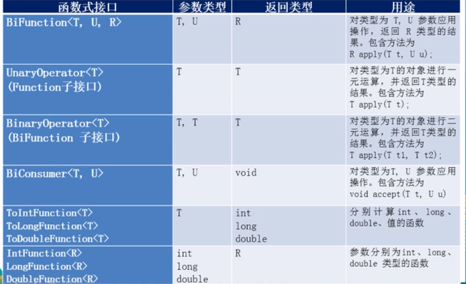

# Lambda表达式

    1.概念
        * Lambda是一个匿名函数，可以将其理解为一段可以传递的代码（将代码像数据一样进行传递）可以写出更
          简洁、更灵活的代码。作为一种更紧凑的代码风格，使得java语言的表达能利得到了提升

    2. Lambda表达式的基础语法
        * java8中引用了一个新的操作符"->"，该操作符称为箭头操作符或者Lambda操作符，箭头操作符将Lambda
          表达式分为了两部分：

            * 左边：Lambda表达式的参数列表
            
            * 右边：Lambda表达式中，所需要执行的功能，即 Lambda体
        
        * 语法格式一：无参数，无返回值的方法
            * () -> Lambda体
            如：() -> System.out.println("hello");

        * 语法格式二：有一个参数，并且无返回值
            * (参数1) -> Lambda体
            如：(x) -> System.out.println("hehe");

        * 语法格式三：若只有一个参数小括号可以省略不写
            * 参数1-> Lambda体
            如：x -> System.out.println("hehe");

        * 语法格式四：有两个以上的参数，有返回值，并且Lambda体中有多条语句
            * (参数1,参数2) -> {语句体1;语句体2};
            如：
                Comparator com = (x,y) -> {
                    System.out.println("函数式接口");
                    return Integer.compare(x,y);
                }

        * 语法格式五：若Lambda体中只有一条语句，return和大括号都可以不写
            * (参数1,参数2) -> 语句体1;
            如：
                Comparator com = (x,y) -> Integer.compare(x,y);

        * 语法格式六：Lambda表达式的参数列表的数据类型可以省略不写，因为JVM编译器通过上下文推断出数据类型
                     即“类型推断”
            如：(Integer x, Integer y) -> Integer.compare(x,y);

    3. Lambda表达式需要“函数式接口”的支持
        * 函数式接口：接口中只有一个抽象方法的借口，称为函数式接口，可以使用注解@FunctionInterface 修饰
                     可以检查是否是函数式接口

    4. java8中内置的四大核心函数式接口
        * Consumer<T> : 消费型接口
            void accept(T t);

        * Supplier<T> : 供给型接口
            T get();

        * Function<T, R> : 函数型接口
            R apply(T t);

        * Predicate<T> : 断言型接口
            boolean test(T t);
            
    5. 其他函数式接口（如下图）

    6. 方法引用
        * 概念：若Lambda 体中的内容有方法已经实现了，我们可以使用“方法引用”（可以理解为“方法引用”是Lambda表达式
                的另外一种表现形式）

        * 主要有三种语法格式：
            <1> 对象::实例方法名

            <2> 类::静态方法名

            <3> 类::实例方法名

        * 注意：
            <1> Lambda体中调用方法的参数列表与返回值类型，要与函数式接口中抽象方法的函数列表和返回值保持一致

            <2> 若 Lambda 参数列表中的第一个参数是实例方法的调用者，而第二个参数是实例方法的参数时，可以使用
                ClassName :: method  (类::实例方法名)

    7. 构造器引用
        * 格式：
            ClassName::new

        * 注意：
            * 需要调用的构造器的参数列表要与函数式接口中抽象方法的参数列表保持一致

    8. 数组引用
        * 格式：
            Type[]::new;

